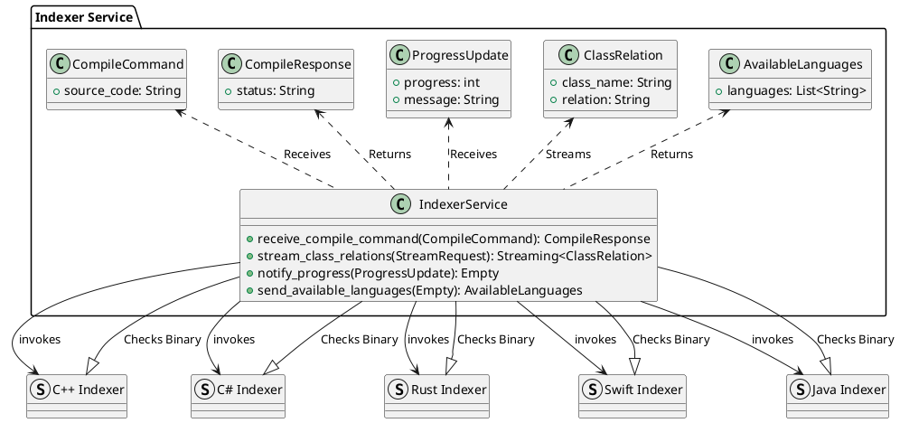

# Indexer Service

## Overview

The Indexer Service is a Rust-based server that uses gRPC to provide a mechanism for compiling code, generating class relations, and streaming results to a client. The service supports multiple programming languages (C++, C#, Rust, Swift, and Java), and it checks the existence of language-specific indexer binaries before processing.

The service also streams progress updates to the client and provides notifications about available languages based on which indexer binaries are available.

## Features

- Compile Commands: Accepts compile commands and streams the resulting class relations based on the requested programming language (C++, C#, Rust, Swift, Java).
- Binary Availability: The service checks whether the indexer binaries for C++, C#, Rust, Swift, and Java are available and notifies the client accordingly.
- Progress Updates: Streams progress updates to the client during the class relation generation.
- Extensibility: The system is designed to easily extend support for additional languages or functionalities.

## Architecture

The architecture consists of the following components:

- gRPC Server: Handles requests from the client and interacts with indexers.
- Indexer Binaries: Language-specific tools that analyze the source code and generate class relations.
- Client: Requests compilation and class relations, receives progress updates, and receives available language notifications.

Here’s a PlantUML diagram that represents the architecture of the service:


## Installation

### Prerequisites

Before you can build and run the Indexer Service, you will need the following installed:

- Rust (with cargo): The programming language for the service.
- Protobuf Compiler (protoc): To compile the gRPC service definition (.proto files) into Rust code.
- gRPC library for Rust (tonic): For asynchronous communication.

Build Instructions

1. Clone the repository:

```bash
git clone https://github.com/your-repo/indexer-service.git
cd indexer-service
```

2. Install dependencies:

```bash
cargo build
```

3. Run the service:

```bash
cargo run
```

The service will start on localhost:50051.

## gRPC API

The Indexer Service provides the following gRPC methods:

### ReceiveCompileCommand

- Description: Receives a compile command and processes it.
- Request:
- CompileCommand: Contains the source code to compile.
-  Response:
- CompileResponse: Returns a status message about the received command.

### StreamClassRelations

- Description: Streams class relations based on the requested language and compiled code.
- Request:
- StreamRequest: Contains the language for which to generate class relations.
- Response:
- Streams ClassRelation objects, each containing a class_name and its relation.

### NotifyProgress

- Description: Sends progress updates during the compilation or processing task.
- Request:
- ProgressUpdate: Contains the progress percentage and an optional message.
- Response:
- Empty: No content.

### SendAvailableLanguages

- Description: Notifies the client of available languages based on the presence of indexer binaries.
- Request:
- Empty: No content.
- Response:
- AvailableLanguages: A list of available languages.

### Error Handling

The service uses gRPC Status to handle errors. If the compilation command fails or an indexer binary is not found, an appropriate error status will be returned to the client.

### Extensibility

The current system supports C#, Rust, Swift, and Java. To extend the service with more languages:

- Add the corresponding indexer binary check in IndexerServiceImpl::check_available_languages().
- Add new logic for generating class relations in generate_class_relations().

## Running Tests

The system includes unit tests for various components, and you can run them using:
```bash
cargo test
```
## License

This project is licensed under the MIT License - see the LICENSE file for details.
